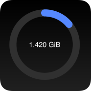
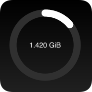
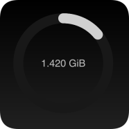
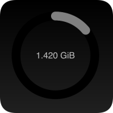

# iOS Mobile Data Usage Widget

Yet another iOS widget that visualizes your mobile data usage, based on [Scriptable.app](https://scriptable.app).

Your mobile device's mobile data usage is fetched from the Telekom status API at [pass.telekom.de](https://pass.telekom.de).
The widget tries to read the usage data from the status API at the time when the widget refreshes. If it succeeds,
it will display this data and keep a copy of it for later use. If it fails, it will display the last fetched data.
If too much time has passed since the last successful fetch of the usage data, the colors of the widget will change
to indicate that the data is outdated.

## Examples

- Recent usage data:

   

- Outdated usage data:

   

## Configuration

To configure the widget, edit the `C` constant in the configuration section at the top of the widget, e.g. to change
colors and the time delta for outdated usage data.
